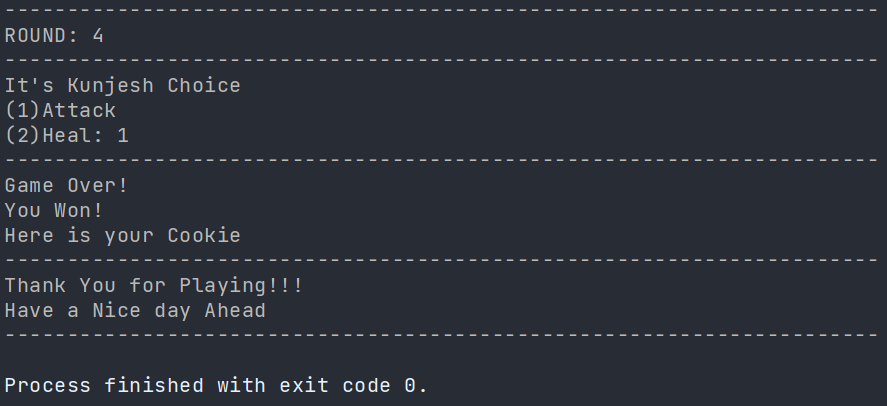

# World War III

## Introduction

I have created this game for fun in my leisure time.

In this game, I have created a Console-based battle game.

| Players           | Features | Choices | Extra Feature               |
|:---               | :---     | :---    |:--                          |
| User              | Armor    | Attack  |Bomb(Only available to User) |
| Enemy (Computer)  | Weapon   | Heal    |                             |

<b>Note:</b> Armor and Weapon is pre-defined for Enemy. 

It has a basic design to easily follow the code .

Code is well-indented, formatted and comments are added where required.

## Project Features

  
Click me :writing_hand:

1. Each armor has different health According to Armor choice, the total health is calculated.

2. Each weapon has different health damage. According to Weapon choice, the health damage is calculated.

3. You can play this game in your leisure time ;)

  
Prize

  `A COOKIE! 🤩🤩🤩`

## Programming Language and Technologies used

- [x] C#
- [x] JetBrains Rider

## Resources

1. College Notes
2. Google

## Screenshots

Introduction

 

Selecting an ARMOR

Selecting a WEAPON

 

BattleGround 

 

# 
**A Big Thank You!**

